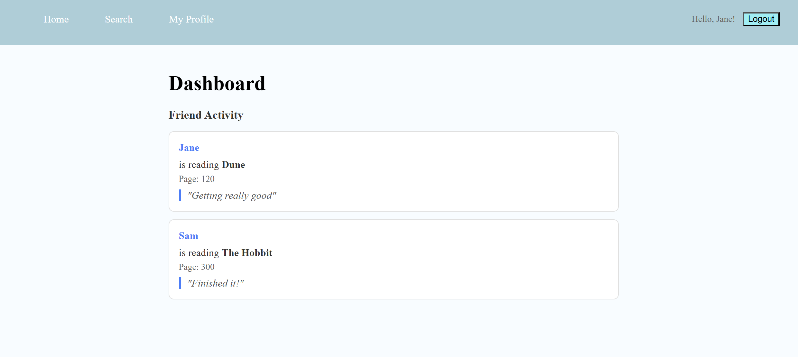
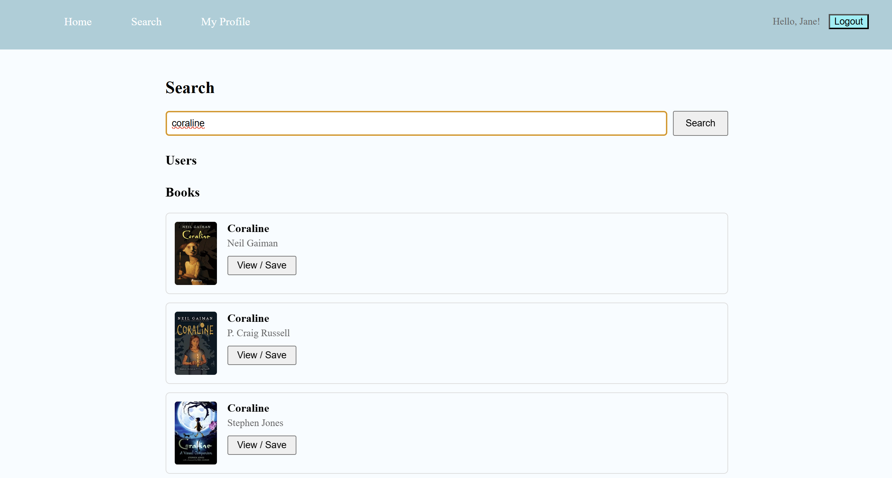
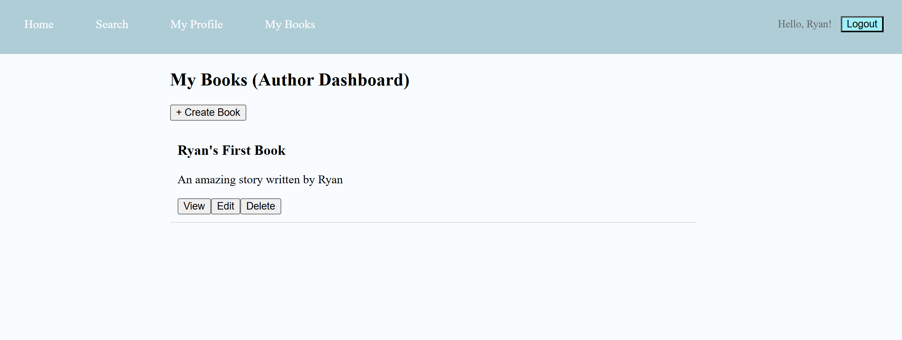
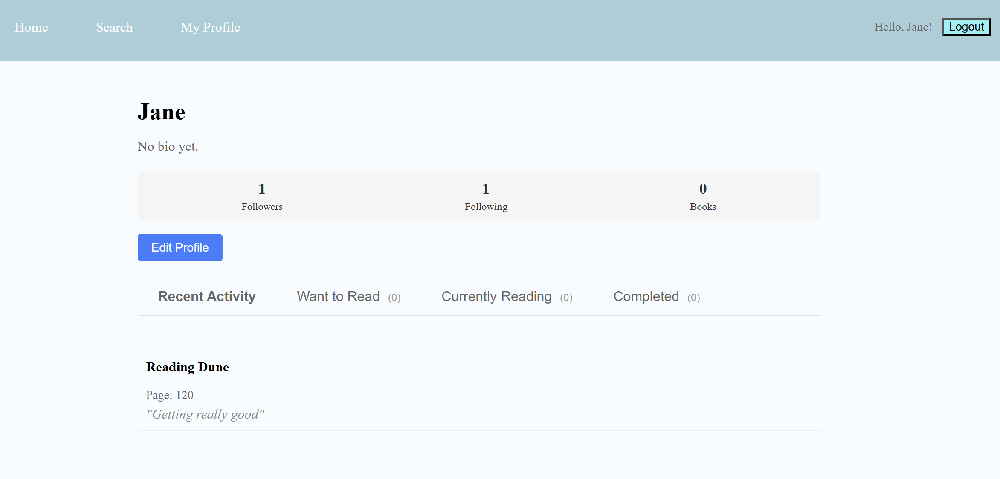

# Welcome to Tetherlog!
A site that allows users to track reading progress, discover books, follow friends and family, and for authors to publish and manage their own books.

## Tech Stack
### Backend 
- Node.js/Express
- SQLite
- JWT Authentication
- Bcrypt password hashing

### Frontend
- React (Vite)
- React Router
- Fetch API wrapper
- Vanilla CSS 

### Architecture
- RESTful API
- Role system that specifies access to resources and features.

## User Roles

### Reader (default)
- Create an account and log in 
- Search books and users
- Track reading status 
    - Want to read 
    - Currently reading
    - Completed
- Follow other users
- view activity feed 

### Author 
- Same permissions as reader on top of author specfic features.
- Create books
- Edit own books
- Delete own books
- Manage a personal catalog "My Books". This tab cannot be seen if the user only has reader status.

It is important to note a reader can become an author through edit profile.

## Core Features 

### Authentication System 
- Secure registration and login 
- Password hashing (bcrypt)
- JWT-based session authentication

### Book System 
- Create book (author only)
- Read book details
- Update book details
- Delete book (author only)

## Reading Status System

### Tracking Progress
- Can mark books as 
    - Want to read
    - Currently Reading
    - Completed 
- Update progress through
    - Create update post with page + a comment 
    - Read the status you put out as well as those of friends.
    - Delete the update if you wish.
    - You are able to update as you go.
- Toggle status dynamically

## User Profiles
- public profile pages
- bio + url changes available. 
- stats:
    - followers 
    - following
    - books tracked
- recent activity feed (yourself and friends most recent posts)

## Follow system
- The ability to follow and unfollow users.
- Following counts displayed on profile.
- Activity based dashboard.

## Search System
- You can search books either locally (DB that auhtors add to) or through the external API.
- Search users 

## Database Schema
There are five core tables: users, books, reading_status, reading_updates, and follows. They generally support book creation, and user interaction (follows or updates, etc.).
### Relationships
- Users to Books
    - one-to-many (authors creating books)
- Users to books and vice versa 
    - many-to-many (reading status)
- users to users 
    - many-to-many (follows)
- Users to reading updates 
    - one-to-many
-Books to reading updates 
    - one-to-many

## Frontend Pages 
- login 
- dashboard 
- search
- book details
- my-books (author)
- personal current user profile/other profiles generally. 
- various edit pages for things like profile, update, etc.

## Setup Instructions 
### Clone the repository 
```
git clone https://github.com/ECU-Web-Development/group-project-group3.git
```
### Install dependencies
#### Start backend 
```
cd backend
npm install
```
#### Start frontend
```
cd react-frontend
npm install
```
### Run the application 
#### Start backend 
```
npm run dev
```
#### Start frontend
```
npm run dev
```
### Open in browser
Click on the link provided after running the frontend.

## Screenshots

### Dashboard


### Search Page


### My Books


### Profile Page

